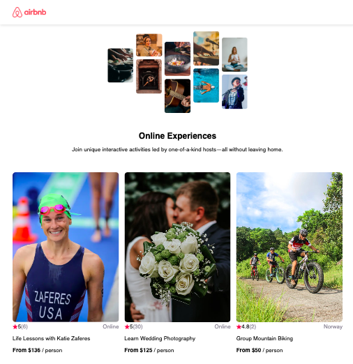

# React Airbnb Clone




A comprehensive React project that mimics the Airbnb interface. Initially built in 2023, it was updated in 2024 to add more data, enhance responsive styling, and update data using `.map()`.

## 🛠 Features

- Rendering components
- Import & export functions
- JSX syntax
- Responsive design
- Data handling with `.map()`

## 🚀 About Me

Self-taught front-end developer with over 3 years of commercial experience.

My background in digital design and marketing, coupled with a design degree, provides a unique perspective in crafting elegant and functional websites. I thrive on turning complex problems into simple, beautiful, and intuitive designs.

## 🔗 Links

[](https://bizzy-coding.github.io/FrontEnd_Portfolio_2023/)
[](https://www.linkedin.com/in/laura-bizzle/)
[](https://www.instagram.com/bizzy_coding/)

## 📈 Project Details

This project was created to practice the core fundamentals of React, such as rendering components, using JSX, and handling data with `.map()`. It was later enhanced to include more comprehensive features, improved responsiveness, and updated data handling techniques.

## 📦 Installation

1. Clone the repository:
   ```sh
   git clone https://github.com/bizzy-coding/React-Airbnb-Clone.git
   ```
2. Navigate to the project directory:
   ```sh
   cd React-Airbnb-Clone
   ```
3. Install dependencies:
   ```sh
   npm install
   ```
4. Start the development server:
   ```sh
   npm start
   ```

## 📝 Credits

Adapted from the [Scrimba React Course](https://scrimba.com/learn/learnreact) taught by Bob Ziroll.
```

### How to Use It with Your Clone

1. **Update Repository URL**:
   Ensure that the GitHub repository URL in the installation section matches your actual repository URL.

2. **Add Screenshot**:
   Replace `` with the actual path to the screenshot of your project.

3. **Deployment Link**:
   Update the live preview link to point to the deployed version of your project.

4. **Personal Links**:
   Make sure the portfolio, LinkedIn, and Instagram links are correct and active.

This `README.md` provides a clear overview of your project, your personal background, and how to set up and run the project. It also gives credit to the resources that helped in the development.